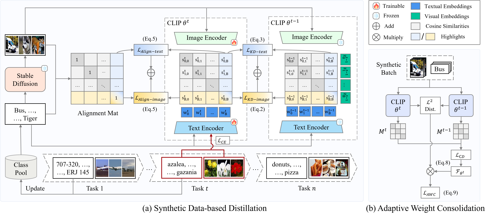

<h1 align='center'>Synthetic Data is an Elegant GIFT for Continual Vision-Language Models</h1>

<p align="center">
School of Computer Science, Wuhan University; Wuhan AI Research<br />
Bin Wu, Wuxuan Shi, Jinqiao Wang and Mang Ye
</p>

<p align="center">
    <a href="https://arxiv.org/abs/2503.04229"></a>
</p>

<p align="center">
    <a href="#overview">Overview</a> |
    <a href="#configure-the-project">Configure the Project</a> |
    <a href="#environment-set-up">Environment Set Up</a> |
    <a href="#prepare-to-generate-images">Prepare to Generate Images</a> |
    <a href="#prepare-mtil-datasets">Prepare MTIL Datasets</a> |
    <a href="#run-experiments">Run Experiments</a> |
    <a href="#acknowledgement">Acknowledgement</a>
</p>

[CVPR 2025] This is the official implementation of paper "Synthetic Data is an Elegant GIFT for Continual Vision-Language Models". In the paper we present GIFT, a novel continual fine-tuning approach for vision-language models, aimed at leveraging synthetic data to mitigate catastrophic forgetting. The code we provide can be used to reproduce the results of our method in the MTIL experimental setting.

If you find our work useful for your research, please consider citing the paper:
```
@inproceedings{wu2025synthetic,
  title={Synthetic Data is an Elegant GIFT for Continual Vision-Language Models},
  author={Bin Wu, Wuxuan Shi, Jinqiao Wang and Mang Ye},
  booktitle={Proceedings of the IEEE/CVF Conference on Computer Vision and Pattern Recognition},
  year={2025}
}
```

## Overview



Framework overview of GIFT. (a) **Synthetic Data-based Distillation** aligns the output of the current CLIP model $\theta^t$ with the previous model $\theta^{t-1}$ on matching synthetic image-text pairs when learning a new task. Image-text alignment loss is applied to correct errors in the teacher model through hard target, i.e., the alignment matrix. (b) **Adaptive Weight Consolidation** employs a parameter importance weighted $l_2$ penalty to limit parameter changes causing forgetting and overfitting. By leveraging the Fisher information $\mathcal{F}_{\theta^t}$ from synthetic image-text pairs during training, parameter importance is adjusted in real-time to achieve a better stability-plasticity balance.

## Configure the Project

In order to run the code properly, you must first fill in the corresponding path in `project_config.json`. We have given examples using relative paths. But to be safe, it is best to replace them with the absolute paths on your machine.

```json
{
    "_comment": "configure the path for project",
    "CL_DATA_LOCATION": null,
    "MTIL_DATA_LOCATION": "./data/mtil",
    "SYN_DATA_LOCATION": "./data/synthetic",
    "CKPT_LOCATION": ".ckpt/"
}
```

Here is an explanation of each item:

- `CL_DATA_LOCATION`: where the CIL datasets are. (not used in this repo)
- `MTIL_DATA_LOCATION`: where the MTIL datasets are.
- `SYN_DATA_LOCATION`: where the synthetic datasets are.
- `CKPT_LOCATION`: where to store checkpoints.

## Environment Set Up

Our project relies on `Python 3.8.18`. First, you need to ensure that `pytorch` of version higher than `1.11.0` is installed. Then install other required dependencies from `requirements.txt`.

## Prepare to Generate Images

We use `Stable Diffusion` v1.5 for inference via the toolkit [diffusers](https://github.com/huggingface/diffusers). Diffusers can be installed simply as follows:

```bash
pip install --upgrade diffusers[torch]
```

We have prepared the prompts we use in path `./data/synthetic` in advance, and can directly run `txt2img.py` to generate synthetic images:

```bash
# Generate for MTIL Order I
python txt2img.py --image_num=1000 --setting=MTIL_I --datasetname=synthetic_data_a
# Generate for MTIL Order II
python txt2img.py --image_num=1000 --setting=MTIL_II --datasetname=synthetic_data_b
```

For convenience, we pre-generate the generated images used by all tasks before continual learning starts.

Note that in the constructor of the `ImgGenerator` class on `line 74` of `txt2img.py`, the pre-trained weights are obtained by default from the [stable-diffusion-v1-5/stable-diffusion-v1-5](https://huggingface.co/stable-diffusion-v1-5/stable-diffusion-v1-5) repository on the Hugging Face website. 

```python
class ImgGenerator:
    def __init__(self, device, model_path = "stable-diffusion-v1-5/stable-diffusion-v1-5", scheduler=False):
        self.device = device
        self.pipeline = DiffusionPipeline.from_pretrained(model_path, torch_dtype=torch.float16)
        
        if scheduler:
            self.pipeline.scheduler = DPMSolverMultistepScheduler.from_config(self.pipeline.scheduler.config)
        
        self.pipeline.to(f"cuda:{device}")
```

If there are loadable local weights, you can modify the instance creation code on `line 118` to pass in the corresponding path as the `model_path` parameter. We recommend downloading the model first and then loading it locally.

```python
generator = ImgGenerator(device = args.device_id, scheduler=(args.steps < 50), model_path="your/path/to/model/weights")
```

## Prepare MTIL Datasets

All datasets of MTIL including `Aircraft`, `Caltech101`, `CIFAR10`, `CIFAR100`, `DTD`, `EuroSAT`, `Flowers`, `Food`, `MNIST`, `OxfordPet`, `StanfordCars`, `SUN397`. 
You can use `gather_datasets.py` to download directly through pytorch api. However, some links may be invalid and you need to find new links through the official website of corresponding datasets. 

## Run Experiments

After MTIL datasets downloading and image synthesis, use the following command to run experiment:

```bash
# Run on MTIL Order I
python ./scripts/run_exp.py --config_path=./configs/mtil_order_I.json
# Run on MTIL Order II
python ./scripts/run_exp.py --config_path=./configs/mtil_order_II.json
```

Or use `run_exp.sh` after authorization.

## Acknowledgement
Our repo is built on [wise-ft](https://github.com/mlfoundations/wise-ft) and [ZSCL](https://github.com/Thunderbeee/ZSCL). We thank the authors for sharing their codes.
